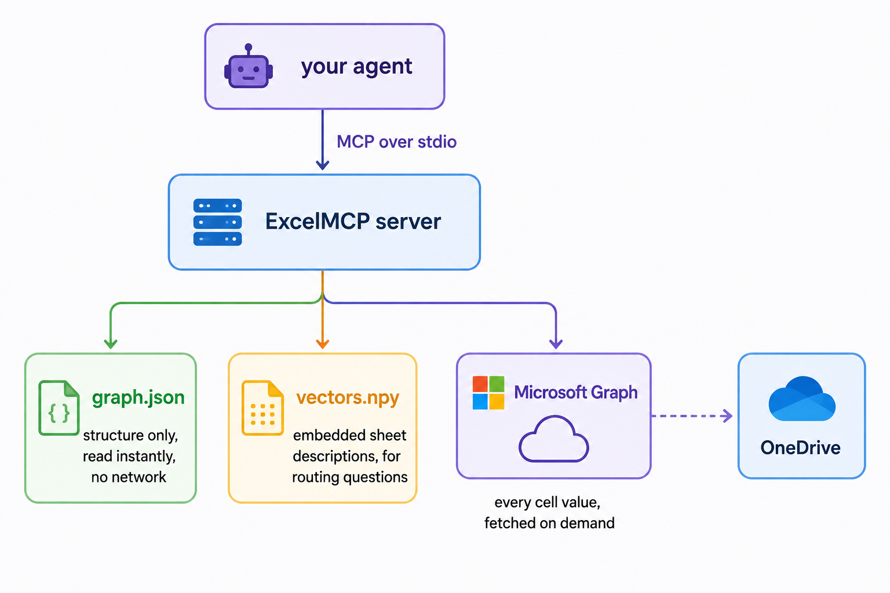

# ExcelMCP

**A live Excel intelligence layer for AI agents.** Point it at a OneDrive folder and your agent can ask questions about those spreadsheets in plain English, against the numbers that are in them right now.

[](https://www.python.org/)
[](LICENSE)
[](https://modelcontextprotocol.io/)
[](https://github.com/jlowin/fastmcp)
[](https://learn.microsoft.com/en-us/graph/)
[](https://github.com/Karunya-Muddana/ExcelMCP)
[](https://github.com/Karunya-Muddana/ExcelMCP/pulls)

---

## The problem this solves

Most spreadsheet integrations work by copying your data somewhere else. They ingest the workbook, chunk it, embed the cell values, and store the whole thing in a vector database. From that moment on your agent is answering questions about a snapshot. Someone updates the inventory sheet at 9am and the agent is still quoting Tuesday's numbers.

ExcelMCP splits the problem in two.

**Structure gets cached.** Filenames, sheet names, column headers, where the header row starts, which columns hold dates, how sheets relate to each other — plus a small sample of distinct labels per low-cardinality column, which is what makes routing work across a hundred near-identical sheets. This changes rarely, it is cheap to store, and it is what the agent needs in order to know *what to ask for*. (The sampled labels are the one place structure touches values; the exact boundary is spelled out in [What lands on disk](#what-lands-on-disk).)

**Data never gets cached.** Every tool call that returns a number goes out to the Microsoft Graph API and pulls it live. There is no data cache to go stale, no sync job to fall behind, and no answer ever served from disk.

Every response carries a `metadata.fetched_at` timestamp and an `is_cached: false` flag so the model can see, in band, that it is looking at fresh data.

---

## How it works

<p align="center">
  
</p>

A natural language question gets embedded, matched against the sheet descriptions by cosine similarity, then reranked by lexical overlap with column names and sampled values — which is what keeps routing meaningful when twenty workbooks share one schema. Those sheets, and only those, get fetched live. Filtering and aggregation then happen in pandas on the freshly fetched frame. Single-value questions skip the row pipeline entirely: `lookup` reads one key column and one row and returns the cell with its provenance.

---

## Requirements

- Python 3.10 or newer
- A Microsoft 365 account with OneDrive
- [uv](https://docs.astral.sh/uv/), or plain pip if you prefer

---

## Install

From the repository root:

```bash
git clone https://github.com/Karunya-Muddana/ExcelMCP.git
cd ExcelMCP

uv sync      # install dependencies
uv build     # build the wheel
pip install dist/excelmcp-0.3.0-py3-none-any.whl
```

Or install straight from source without building:

```bash
pip install .
```

There is no compiler step and no native extension to build. Vector search runs on a NumPy cosine scan rather than hnswlib, specifically so that `pip install` works on a machine with no C++ toolchain.

---

## Setup

Run the wizard once:

```bash
excelmcp-setup
```

It walks through four things:

1. Microsoft device-flow sign in. You get a code, you paste it into the browser, the token cache lands in `~/.excelmcp/token.json` with `0600` permissions.
2. Which OneDrive folder to index, for example `/ERP`.
3. A scan of every `.xlsx` in that folder to build the structure graph and the embeddings.
4. Detection of the AI agents already installed on your machine, and a written config entry for the ones you pick.

### Agents it can configure automatically

| Agent | Config file |
|---|---|
| Claude Code | `~/.claude.json` |
| Claude Desktop | `claude_desktop_config.json` |
| Cursor | `~/.cursor/mcp.json` |
| Windsurf | `~/.codeium/windsurf/mcp_config.json` |
| Gemini CLI | `~/.gemini/settings.json` |
| Codex CLI | `~/.codex/config.toml` |
| VS Code (Copilot) | VS Code user `mcp.json` |
| Cline | extension `cline_mcp_settings.json` |
| Continue | `~/.continue/config.yaml` |
| Goose | `~/.config/goose/config.yaml` |
| Zed | `~/.config/zed/settings.json` |
| Hermes | `~/.hermes/config.yaml` |

Existing config files are backed up before they are touched. If your agent is not on the list, the wizard prints the exact JSON or TOML block to paste in yourself.

### Other wizard commands

```bash
excelmcp-setup list-agents           # show what was detected
excelmcp-setup install --only cursor # register with one agent, skip the rescan
excelmcp-setup doctor                # diagnose a broken install
excelmcp-setup uninstall             # remove ExcelMCP from every agent config
excelmcp-setup --folder /ERP --yes   # fully non-interactive
excelmcp-setup --dry-run             # print the changes, write nothing
```

---

## Tools exposed to the agent

| Tool | Network | What it does |
|---|---|---|
| `get_workspace_graph` | none | Full structure of the workspace: files, sheets, columns, table regions, relationships, naming variants, scan age. Instant. |
| `inspect_file` | none | Same, narrowed to one file, with approximate row counts as of the last scan. Instant. |
| `scan_workspace` | heavy | Re-crawls OneDrive and rebuilds structure, sampled values, relationships, embeddings. |
| `query` | live | Natural language question, routed by vector similarity plus lexical rerank. |
| `lookup` | live | One call → one cell value with file/sheet/cell provenance and a confidence signal. |
| `get_cell` | live | One addressed cell in one Graph request. |
| `filter_sheet` | live | Fetch one sheet, return rows matching conditions. |
| `aggregate` | live | Fetch one sheet, group and reduce it, with `having`. |
| `cross_file_aggregate` | live | Fetch matching sheets from every file, fold into a total. |
| `join_sheets` | live | Merge two sheets on key columns, suggested from known relationships. |
| `derive` | live | Signed sum over transaction types — net stock in one call. |

The two structure tools are free and instant because they read the local graph. Everything marked live goes to the API on every single call.

---

## Usage

Once the server is registered, you mostly just talk to your agent normally. Under the hood it makes calls like these.

Orient first. The agent should always do this before guessing at a column name, since no two companies name things the same way:

```python
get_workspace_graph(folder_path="/ERP")
```

Ask a question without knowing where the answer lives:

```python
query("what are the top 10 products by sales value", folder_path="/ERP")
```

Filter a known sheet:

```python
filter_sheet(
    file_name="Inventory.xlsx",
    sheet="Stock",
    conditions={"Status": "Low", "Quantity": "<50"},
    folder_path="/ERP",
    sort_by="Quantity",
    limit=100,
)
```

Supported condition operators, all ANDed together:

| Form | Meaning |
|---|---|
| `{"Col": "value"}` | exact match — case- and whitespace-insensitive; pass `exact_case=True` for strict |
| `{"Col": "~value"}` | contains, literal substring, not a regex |
| `{"Col": ">100"}` | greater than (also `>=`, `<`, `<=`) |
| `{"Col": ">=2026-01-01"}` | date bound, ISO-8601, works on detected date columns |
| `{"Col": {"in": ["a", "b"]}}` | any of the listed values |
| `{"Col": {"between": [10, 500]}}` | inclusive range, numeric or date |
| `{"Col": {">=": "2026-01-01", "<": "2026-04-01"}}` | combined bounds |
| `{"Col": {"is_null": false}}` | null check — blanks and empty strings count as null |

A column name or operator that does not exist raises an error rather than quietly returning zero rows, which is the failure mode that makes an agent confidently report the wrong thing. When conditions legitimately match nothing, the response carries `zero_match_diagnostics` — what each condition matched on its own, plus up to twenty values actually present in the offending column — so a near-miss gets corrected instead of reported as "no data".

Ask for a single figure in one call:

```python
lookup(query="contracted rate for Titanium Dioxide under the BESTEX contract",
       folder_path="/Contracts")
```

The answer comes back with provenance — file, sheet, cell address, the matched row — and a confidence field. Multiple matching rows return `ambiguous` with every row; sheets that disagree return `conflict` with every version and no value; a misspelled key returns fuzzy suggestions. The tool never returns a bare number.

Group and reduce inside one file:

```python
aggregate(
    file_name="Sales.xlsx",
    sheet="Q1",
    group_by="Region",
    value_col="Revenue",
    operation="sum",
    folder_path="/ERP",
)
```

Total the same sheet across every file in the workspace:

```python
cross_file_aggregate(
    sheet="Q1",
    value_col="Revenue",
    operation="sum",
    folder_path="/ERP",
    conditions={"Status": "Closed"},
)
```

`cross_file_aggregate` returns a per-file breakdown alongside the total, plus `skipped_files` when a file could not be read and `unmatched_files` — with `did_you_mean` candidates — for every file that does not contain the exact sheet name. That way a partial total is visibly partial instead of silently wrong, including the case where the sheet is named `Sales` in some files and `Sales 2024` in others. Check `sheet_name_variants` in `get_workspace_graph` before aggregating to see that fragmentation up front.

---

## Agent playbook

Getting the server installed is the easy half. The [agents/](agents/) folder covers the other half: how to prompt an agent that has these tools, how to wire it into each host, and what to automate once it works.

| | |
|---|---|
| [agents/system-prompt.md](agents/system-prompt.md) | A drop-in system prompt for custom agents, subagents, `CLAUDE.md`, or Cursor rules. Full and trimmed versions, plus a template for pinning down your own workspace's quirks. |
| [agents/prompts.md](agents/prompts.md) | Copy-paste prompts sorted by job: orientation, straight answers, analysis, verification, reporting, data quality. Ends with a set of anti-prompts, the reasonable-looking phrasings that reliably produce wrong answers. |
| [agents/guides/getting-started.md](agents/guides/getting-started.md) | A first session that proves the chain works end to end, including how to verify for yourself that the data really is live. |
| [agents/guides/hosts.md](agents/guides/hosts.md) | What gets written to each of the twelve supported host configs, how to verify it, per-host quirks, and how to drive the server programmatically with no host at all. |
| [agents/guides/query-patterns.md](agents/guides/query-patterns.md) | Which tool to reach for, how semantic routing actually picks a sheet, what the condition syntax cannot express, and the data shapes that produce confident wrong answers. |
| [agents/guides/troubleshooting.md](agents/guides/troubleshooting.md) | Symptoms decoded, from PATH problems and 403s through to garbled column names and totals that come out double. |
| [agents/routines/](agents/routines/) | Four ready-to-schedule routines: daily inventory check, weekly sales digest, month-end reconciliation, data quality audit. Each with the prompt, the scheduling, and what tends to go wrong. |

## Guardrails built into the server

The server ships a set of operating rules in its MCP instructions, which the host model reads before it makes its first call. They exist because these are the specific ways an LLM gets spreadsheet questions wrong:

- Never assume a filename, sheet name, or column name. Discover it from the graph.
- Never add up cross-file numbers mentally. Call `cross_file_aggregate` and let the tool do it.
- Never reach for `openpyxl`, `pandas.read_excel`, or the local filesystem. The files are not on this machine.
- Never sum a quantity column in transaction-style data raw — use `derive` with the transaction types spelled out.
- Date columns arrive as ISO-8601 strings, already converted from serials by the server. Never do serial arithmetic by hand.
- For a single figure, call `lookup` and cite the provenance it returns; surface its `ambiguous` and `conflict` outcomes instead of picking a value.
- Check the `truncated` and `total_matched` fields before claiming a result is complete.

Hosts that ignore server instructions, and custom agents you build yourself, need this stated in their own prompt. See [agents/system-prompt.md](agents/system-prompt.md).

---

## Configuration

| Variable | Default | Purpose |
|---|---|---|
| `EXCELMCP_CLIENT_ID` | built in | Azure AD application client ID |
| `EXCELMCP_TENANT_ID` | `common` | Tenant. Use `common` for personal accounts. |
| `EXCELMCP_DEFAULT_FOLDER` | unset | Folder to use when a tool call omits `folder_path`. The wizard writes this into your agent config. |
| `EXCELMCP_MAX_CONCURRENCY` | `8` | Maximum simultaneous Microsoft Graph requests, across every code path. |

The built in client ID is a public client used for device-code flow. It carries no secret, it is visible in every auth request by design, and it is safe to have in this repository. Swap it for your own app registration if you want the consent screen to carry your organisation's name.

---

## What lands on disk

```
~/.excelmcp/
  token.json           MSAL token cache. Auth material only, written 0600.
  graph.json           Structure graph: item IDs, sheet names, column headers,
                       used-range dimensions, date column types, per-sheet
                       table regions, inferred and formula-declared
                       relationships — and sampled values (see below).
  vectors.npy          Embedded sheet descriptions for semantic routing.
  metadata.json        Labels and lexical terms tying each embedding to a sheet.
  relationships.yaml   Optional, written by you: declared join relationships.
```

**The honest version of the no-cache claim, as of 0.3.0.** No row of your
data, no cell grid, and no queryable value is stored on disk — every answer
is served from a live fetch, always. There is one deliberate exception:
`graph.json` stores **sampled values**, up to 50 distinct text labels per
low-cardinality column (client names, statuses, material names, units),
captured at scan time. They exist so that a hundred structurally identical
sheets are distinguishable when routing a question, so that `lookup` can find
which sheet contains "BESTEX" without downloading everything, and so that
relationships can be inferred from value overlap rather than assumed from
column names. They are routing evidence, not a data cache: nothing ever
answers a question from them, and a workspace scan refreshes them wholesale.
The graph also stores a per-sheet structure fingerprint (header columns and
used-range address) purely to detect drift, and — new in 0.3.0 — a **region
map**: the row spans of each table body on a sheet, derived from the ranges the
sheet's own `SUM`/`COUNT`/`AVERAGE` formulas refer to, plus the addresses any
cross-sheet formula reads. Those are row numbers and cell addresses, not
contents; no value is read to produce them. A region's `label`, where present,
is the second deliberate exception alongside sampled values: a few words read
from the section-banner cell immediately above a region (`"NAPHTHALENE"`,
`"OLEUM 65%"`), kept so the model can name which table it means instead of
guessing from row numbers. It is structural metadata describing the sheet's
layout, not row data — the same distinction sampled values already draw. If
any of this is more than you want on disk, don't scan that folder; if you want
to verify the boundary, `graph.json` is small and readable, so go look.

On Windows, `os.chmod` only toggles the read-only bit, so the `0600` mode is a best effort there and the real protection is the default per-user ACL on `%USERPROFILE%`. On macOS and Linux the mode is applied to the temp file before any content is written to it, so the token never briefly exists as world readable.

---

## Tests

```bash
# offline unit tests, no network and no credentials required
pytest tests/test_unit.py

# live integration tests against a workspace you have already scanned, opt in
EXCELMCP_TEST_FOLDER=/ERP pytest tests/test_live_integration.py -v
```

The integration suite skips itself when `EXCELMCP_TEST_FOLDER` is unset, so a plain `pytest` run stays offline.

---

## Project layout

```
agents/           prompts, host guides, and schedulable routines
auth.py           MSAL device flow, token cache, proactive refresh
graph_client.py   Graph API wrapper, 429 backoff, shared concurrency gate
structure.py      Structure discovery, value sampling, relationship inference
embeddings.py     FastEmbed vectors, NumPy cosine search, lexical rerank
query_engine.py   Conditions, live fetch, aggregation, joins, derive
lookup.py         Single-cell lookup pipeline and get_cell
ranges.py         A1-notation range arithmetic
main.py           FastMCP tool definitions and server entry point
cli.py            Setup wizard, agent detection, config writing
agents.py         Per agent config formats and file locations
storage.py        Atomic writes, stderr logging, config directory handling
```

---

## Contributing

Issues and pull requests are welcome. If you are adding support for another agent, `agents.py` is the only file you should need to touch: add an `AgentSpec` with the config path, the entry shape, and a detection hint.

---

## License

MIT. See [LICENSE](LICENSE).
